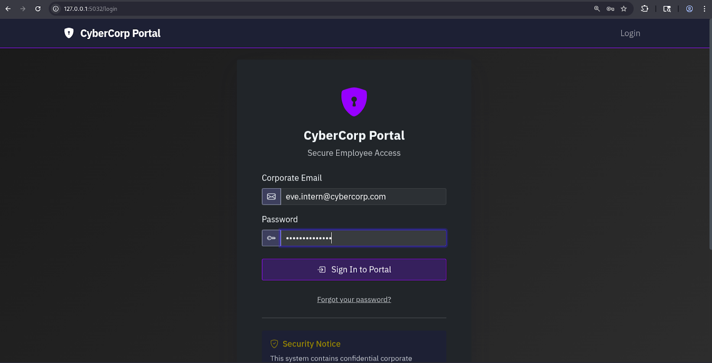
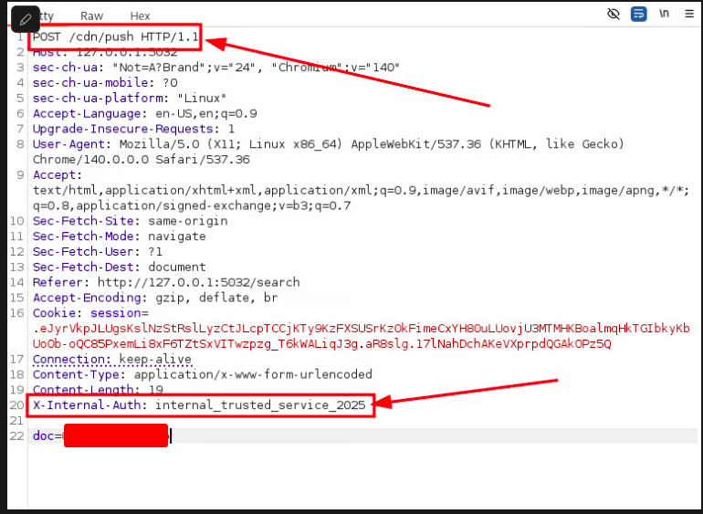

# CacheMe

## Description

You're an intern integrating "CyberCorp" the new in-house caching library. The API is flawless, but the developer portal hides strange config snippets, references to shadow endpoints and dormant feature flags the senior devs dismiss as "internal tools."

 

Your code works, but your instincts scream. This library isn't just storing data; it's hiding something. While the team celebrates the performance boost, you're digging, convinced that the very thing making the system faster is also its most dangerous blind spot. You need to find the flaw they either don't see or don't want you to see.

Creds:&#x20;

* [eve.intern@cybercorp.com](mailto:eve.intern@cybercorp.com)
* EveIntern2024!

\
CacheMe Overview and flow of Solution

1. Login with given credentials

<figure><figcaption></figcaption></figure>

 

2. Head over to doc you will see many files here trying to open each file one by one but you see most of the files can’t be accessed directly as an intern user, for internal walkthrough our file target is Q4-2024-Roadmap. It stores our files.

<figure><figcaption></figcaption></figure>

 

3. Use dirsearch to get some directory listing you will find a logs directory

<figure><figcaption></figcaption></figure>

4. Head over to http://\<url>\_32/logs, you will notice 2 things: it's a log file of this application.&#x20;

<figure><figcaption></figcaption></figure>

And a request Header is also leaked X-INTERNAL\_AUTH=internal\_trusted\_service\_2025

<figure><figcaption></figcaption></figure>

5. Turn on the proxy of burp suit and capture the request of opening the file shown in picture and send it to repeater

<figure><figcaption></figcaption></figure>

 

Change the Method to POST and change the path to /cdn/push to cash this file and also include the header that we found in logs

<figure><figcaption></figcaption></figure>

We got response&#x20;

<figure><figcaption></figcaption></figure>

Means the file is cached as as now stop the proxy and click again on Q4-2024-Roadmap

6.  Click on the file and get the content

    <figure><figcaption></figcaption></figure>

 
